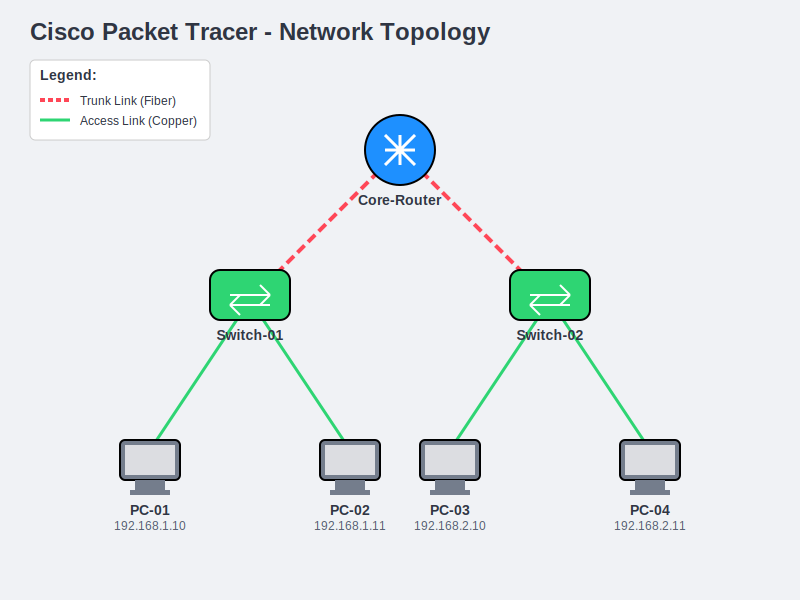
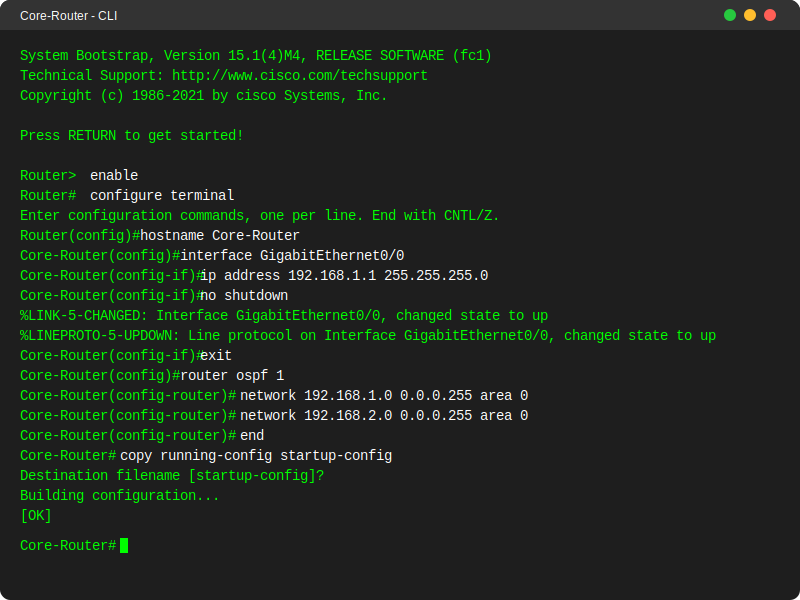
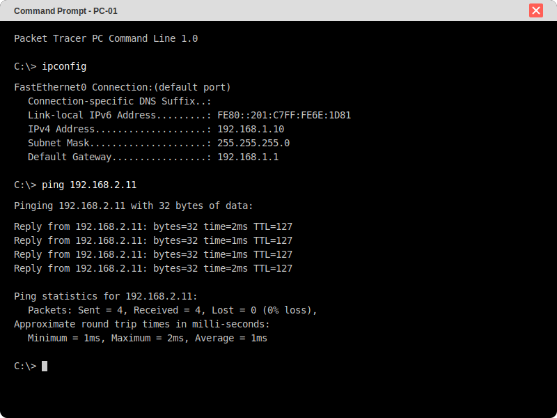

  <h1>🌐 Cisco CCNA Practical: Router to LAN | تدريب عملي: ربط راوتر بشبكة محلية</h1>
  
A network simulation project using Cisco Packet Tracer | مشروع محاكاة شبكات باستخدام سيسكو باكت تريسر

  
  

    <a href="#english">🇬🇧 English</a> • <a href="#arabic">🇸🇦 العربية</a>
  

  
  
  

---

 

## 📸 Network Diagrams & Assets | المخططات

  
  
  

 

## 🇬🇧 English Documentation

### 📌 About the Project
This project is a hands-on **Cisco CCNA Practical Exam** simulation. It focuses on the fundamental networking task of connecting a Cisco router to a Local Area Network (LAN) using **Cisco Packet Tracer**. The project includes the `.pkt` simulation file along with documentation explaining the steps and configurations required to establish connectivity.

### 🌟 Key Objectives
- **Router Configuration:** Basic setup of hostnames, passwords, and interface IP addresses.
- **LAN Connectivity:** Connecting switches and end devices (PCs) to the router's GigabitEthernet/FastEthernet interfaces.
- **Verification:** Testing end-to-end connectivity using ICMP (ping) between LAN devices and the router.
- **Documentation:** Accompanied by detailed Word documents explaining the specific tasks (Lab 10.3.4).

### ⚙️ How to Run the Simulation

1. **Prerequisites:**
   You must have **Cisco Packet Tracer** installed on your machine.
2. **Open the Project:**
   Locate the file `ccna exam.pkt` in the project directory.
3. **Launch:**
   Double-click the file to open it in Packet Tracer.
4. **Explore:**
   - Access the CLI of the router to view configurations.
   - Use the PCs' command prompt to test `ping` to the default gateway.
   - Refer to the attached `.docx` files for the full lab requirements.

 

---

## 🇸🇦 دليل المشروع (العربية)

### 📌 عن المشروع
هذا المشروع عبارة عن محاكاة لـ **اختبار عملي لشهادة Cisco CCNA**. يركز على المهمة الأساسية في الشبكات وهي ربط جهاز التوجيه (Router) بشبكة محلية (LAN) باستخدام برنامج **Cisco Packet Tracer**. يحتوي المشروع على ملف المحاكاة الجاهز `.pkt` بالإضافة إلى مستندات نصية تشرح الخطوات والإعدادات اللازمة لإنشاء الاتصال بنجاح.

### 🌟 الأهداف الرئيسية للمشروع
- **إعدادات الراوتر:** الإعدادات الأساسية مثل تعيين اسم الجهاز (Hostname)، كلمات المرور، وعناوين IP للمنافذ.
- **توصيل الشبكة المحلية:** ربط المحولات (Switches) والأجهزة الطرفية (PCs) بمنافذ الراوتر.
- **التحقق من الاتصال:** اختبار الاتصال من البداية للنهاية باستخدام أمر `ping` بين أجهزة الشبكة المحلية والراوتر.
- **التوثيق العملي:** مرفق مع المشروع ملفات Word (Lab 10.3.4) تشرح المتطلبات التفصيلية للتجربة العملية.

### ⚙️ كيفية تشغيل المحاكاة

1. **المتطلبات الأساسية:**
   يجب أن يكون برنامج **Cisco Packet Tracer** مثبتاً على جهازك.
2. **فتح المشروع:**
   ابحث عن الملف `ccna exam.pkt` داخل مجلد المشروع.
3. **التشغيل:**
   انقر نقراً مزدوجاً على الملف لفتحه داخل بيئة Packet Tracer.
4. **الاستكشاف والتطبيق:**
   - ادخل إلى واجهة سطر الأوامر (CLI) الخاصة بالراوتر لاستعراض الإعدادات.
   - استخدم موجه الأوامر (Command Prompt) في أجهزة الكمبيوتر لاختبار الـ `ping` على البوابة الافتراضية (Default Gateway).
   - راجع ملفات الـ Word المرفقة لفهم تفاصيل التجربة العملية ومتطلباتها.

 

---

  
Built by <b>Waleed Mohsen Al-Ansi</b>

  
📞 +967 773 157 823

